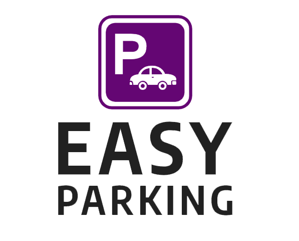
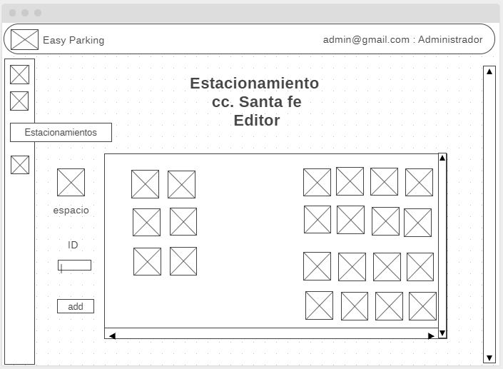
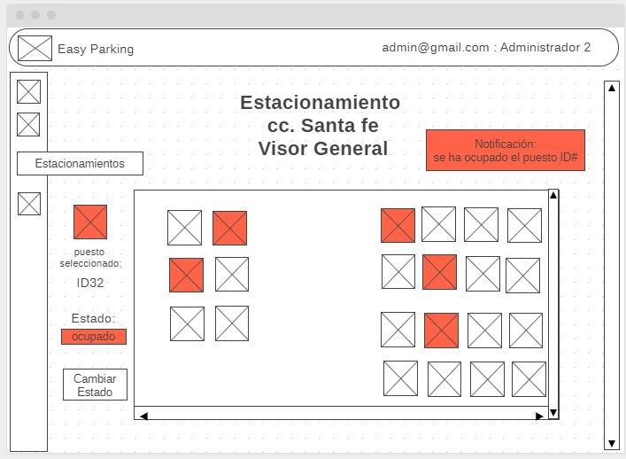
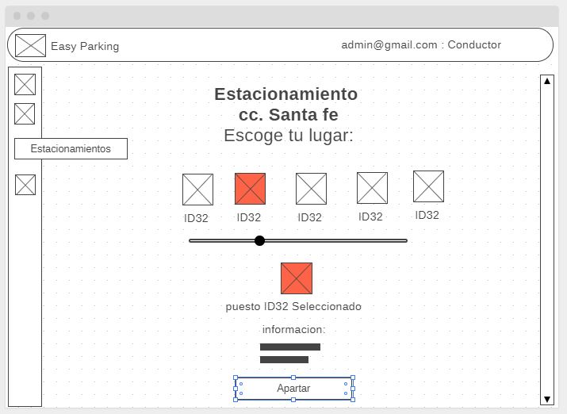
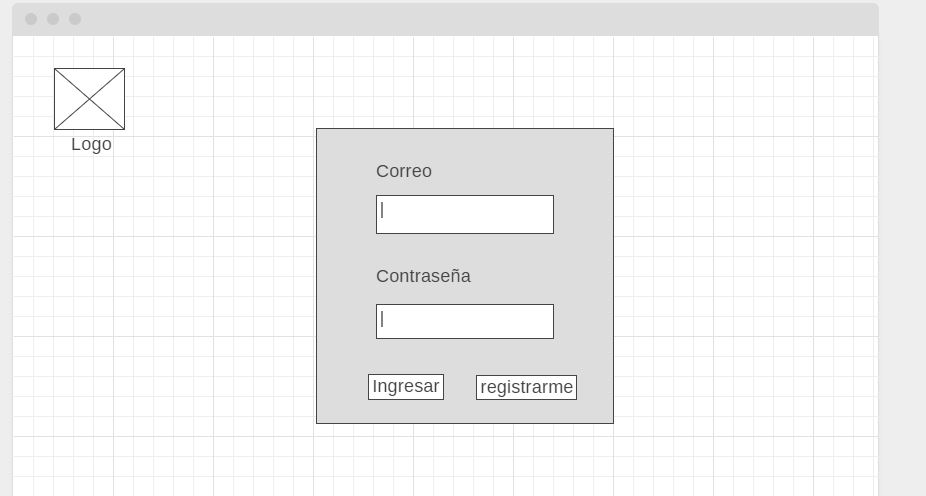
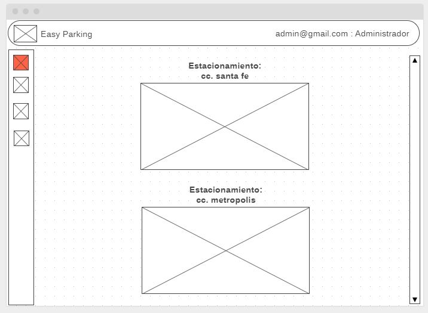
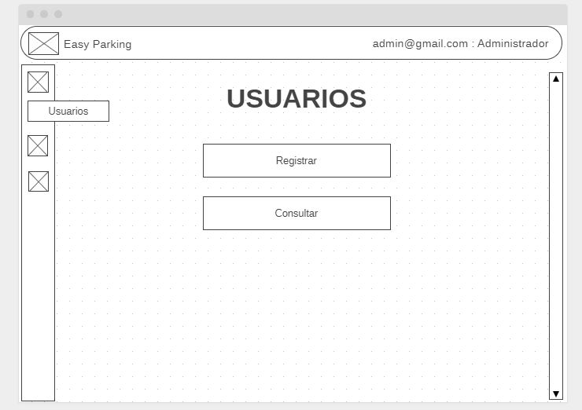
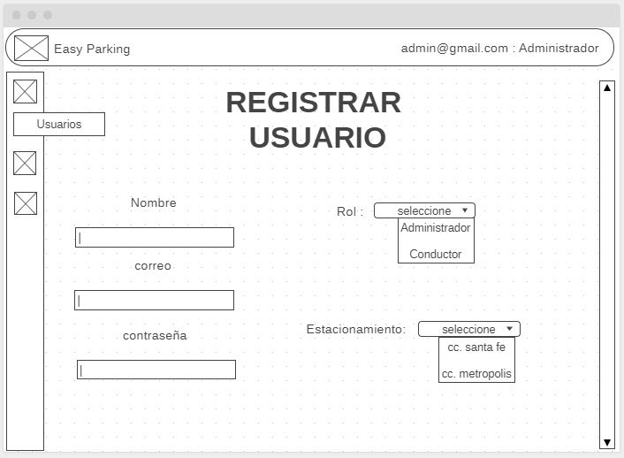
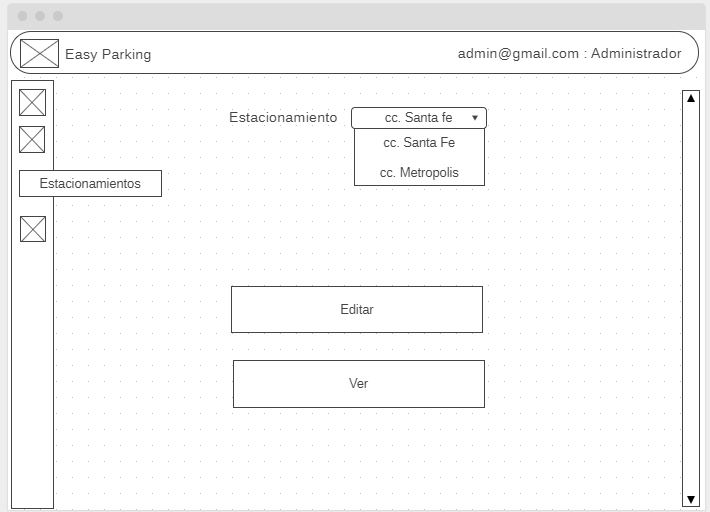

# SPRINT 1 Definición del proyecto - Proyecto ARSW - Easy Parking 

# Logo:

    

# Resumen

Easy Parking - Sistema de gestión de Estacionamiento para Establecimientos

Esta es una aplicación web diseñada para darle un soporte de gestión totalmente tecnológico y perzonalizado integrando los sistemas IoT (Internet of Things) del establecimiento consiguiendo el máximo beneficio, productividad y control.

# Descripción

contará con dos tipos de usuarios y vistas:

- **Interfaz/vista Administrador:**

    - contara con un sistema para gestionar las posiciones y pisos del estacionamiento
    - también mostrará como un mapa con cada piso y lugares de estacionamiento donde cada lugar tendrá una opción para bloquear/abrir cada espacio del estacionamiento, 
    - opción para traer la información de los dispositivos IoT (dispositivos que bloquean o permiten el espacio a un lugar en el estacionamiento) y se sincronice con el mapa del estacionamiento para que este actualice o alimente cuando un lugar ha sido ocupado o está libre.

    

        
    

    - **usuarios que interactúan:**

        - usuario administrador (principal).

- **Interfaz/vista Administrador 2: (involucrando real time)**

    - también mostrará como un mapa con cada piso y lugares de estacionamiento donde cada lugar tendrá una opción para bloquear/abrir cada espacio del estacionamiento, 
    - opción para traer la información de los dispositivos IoT (dispositivos que bloquean o permiten el espacio a un lugar en el estacionamiento) y se sincronice con el mapa del estacionamiento para que este actualice o alimente cuando un lugar ha sido ocupado o está libre.
    - Notificaciones y alertas constantes con el estado en tiempo real del estacionamiento

    

        
    

    - **usuarios que interactúan:**

        - usuario administrador (principal).

- **Interfaz/vista usuario normal (esto estara en la entrada en un tablero con panel tactil controlando el ingreso) que ve y aparta un lugar en el estacionamiento:  (involucrando real time)** 

    - se le mostraran los lugares libres apilados en un slide donde el usuario escoge su lugar y se le confirmara el lugar exacto de este.
    - esta vista se alimentará también de la información de los dispositivos IoT para tener actualizado en tiempo real los lugares disponibles.

    

        
    

    - **usuarios que interactúan:**

        - usuario normal (conductor).

## Necesidades que cubre nuestro proyecto

- poder tener un sistema tecnológico funcionando las 24h donde gestione y controle un estacionamiento.

## Problemas que se resuelven

- Evita bloqueo y largas filas en los estacionamientos.
- llevar un mejor control y orden en el estacionamiento.
- Actuar eficazmente cuando el estacionamiento colapse (fines de semana, festivos o fechas especiales):
    - gracias a las alertas se da tiempo a crear un plan estratégico poniendo nuevos lugares o boqueando las entradas ya que el sistema notificara cuando ya se esté excediendo el límite.

## Nicho de Mercado

- Establecimientos grandes con IoT como:
    - Centros Comerciales.
    - edificios corporativos.
    - conjuntos residenciales.
    
- Establecimientospequeños/medianos implementandoles IoT (sensores basicos):
    - parqueaderos de barrios.
    - estacionamientos de:
     - restaurantes
     - parques
     - conjuntos pequeños

## Valor añadido

- Como es un sistema dinámico, se puede implementar fácilmente a las necesidades del cliente convirtiéndolo en un sistema para gestión de otras cosas como por ejemplo (sistema para abrir y cerrar las puertas del establecimiento).

# Mockups principales

## pagina registro/login

    

## pagina inicio Administrador principal

    

## pagina usuarios Administrador principal

    

## pagina registro nuevo usuario Administrador principal

    

## pagina Estacionamiento Administrador principal

    

## pagina Editor Estacionamiento Administrador principal

    

## pagina Visor Estacionamiento Administrador 2 

    

## pagina Visor Estacionamiento conductor (panel tactil de control de ingreso)

    

# Autor

* **JAIME MARTINEZ ** - *Initial work* - [VASHIGO](https://github.com/Jaime107/ProjectARSW)

# Licencia

This project is licensed under the GNU General Public License - see the [LICENSE](LICENSE) file for details
